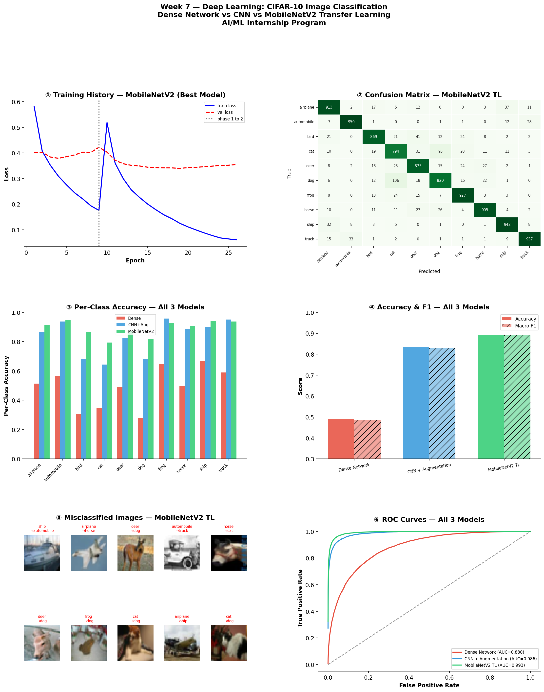

# Week 7 — Deep Learning & Image Classification
**Student:** Adina Zafar | SP24-BSE-006
**Internship:** AI/ML Internship Program — Week 7 of 8
**Instructor:** Zain Ul Abideen
**Dataset:** CIFAR-10 — Keras built-in
**Source:** keras.datasets.cifar10 | 60,000 images, 32×32 pixels, 3 channels | 10 classes | Supervised
**Classes:** airplane, automobile, bird, cat, deer, dog, frog, horse, ship, truck

**What I did this week**
switched from sklearn to TensorFlow/Keras and trained three models on CIFAR-10 to classify images into 10 classes. ran an ablation study across 3 CNN variants (no regularisation → BatchNorm only → BN + Dropout), added data augmentation, then did two-phase transfer learning with MobileNetV2. compared everything using accuracy, F1, and ROC-AUC.

**3 Models Trained**
| Model | Test Accuracy | ROC-AUC | Notes |
|---|---|---|---|
| Dense Network | 48.67% | — | flattened pixels, no spatial awareness |
| CNN + Augmentation | 83.86% | 0.9857 | 3 conv blocks, BatchNorm + Dropout + augmentation |
| **MobileNetV2 TL** | **89.90%** | — | **best model** — frozen base → fine-tuned last 30 layers |

best model: MobileNetV2 Transfer Learning at 89.90% — Phase 1 trained only the new head (3 min, 87.59% val acc), Phase 2 unfroze the last 30 layers at lr=1e-5 and pushed it to 89.90% in 6 more minutes. only ~330K of 2.59M parameters were actually trainable.

**Dashboard**

**5 Key Findings**
1. Dense Network hits a hard ceiling at 48.67% — flattening 32×32 pixels loses all spatial structure, so cat/dog and automobile/truck pairs get confused constantly
2. BatchNorm didn't speed up convergence — no-reg crossed 70% val accuracy first, BN's payoff was a smoother loss curve and smaller overfitting gap (0.193 vs 0.229)
3. BN + Dropout together gave the biggest jump — 11 point accuracy gain over no-reg, overfitting gap collapsed from 0.237 to 0.054
4. augmentation flipped the overfitting gap negative but traded a tiny bit of peak accuracy — val accuracy started matching or beating train accuracy, model just needed more epochs
5. transfer learning won on every metric in a fraction of the compute — Phase 1 alone already beat every from-scratch CNN, because CIFAR-10's animals and vehicles overlap heavily with ImageNet

**Tools**
Python, NumPy, Pandas, Matplotlib, Seaborn, TensorFlow, Keras, Scikit-learn, ImageDataGenerator, MobileNetV2 (pretrained)
